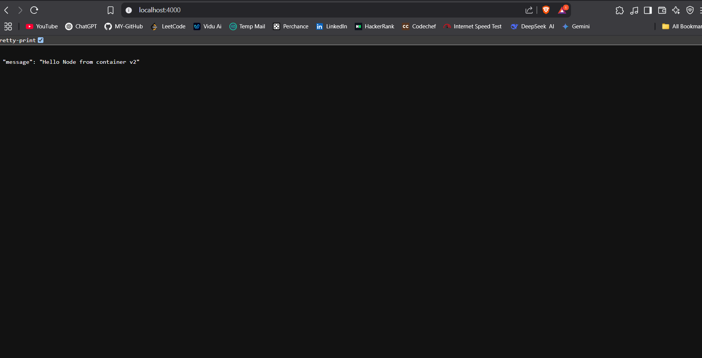

# 🐳 Docker Basic Commands Cheat Sheet

This is my personal reference for essential Docker commands while learning containerization.

---

## 📦 Basic Container Commands

| Action                        | Command                                     |
|-------------------------------|--------------------------------------------|
| Check Docker version          | `docker --version`                          |
| Check system info             | `docker info`                               |
| List running containers       | `docker ps`                                 |
| List all containers (stopped) | `docker ps -a`                              |
| List all images               | `docker images`                             |
| Pull an image from Docker Hub | `docker pull ubuntu`                        |
| Run a container (interactive) | `docker run -it ubuntu bash`                |
| Run container (detached)      | `docker run -d ubuntu sleep 1000`           |
| Stop a running container      | `docker stop <container_id>`                |
| Remove a container           | `docker rm <container_id>`                  |
| Remove an image              | `docker rmi <image_id>`                     |
| View container logs          | `docker logs <container_id>`                |
| Execute command inside container | `docker exec -it <container_id> bash`    |

---


## Port Mapping 

`docker run -it -p 3000:3000 <image_name>`

<br>

## Docker Node app build Commands [ build an Image for Local machine Not public]
node App is in the /docker-app file 

`docker build  -t <image_name> .`
`docker build  -t fisrt-mynode .`

## main.js file 
```javascript
      const express = require('express');
const app = express();

const PORT = process.env.PORT || 8000;

app.get('/', (req, res) => {
    return res.json({ message: "Hello Node from container v2" });
});

app.listen(PORT, () => console.log(`Server is running on port ${PORT}`));
```

##  Dockerfile 
```javascript
FROM ubuntu

RUN apt-get update
RUN apt-get install -y curl
RUN curl -sL https://deb.nodesource.com/setup_18.x | bash -
RUN apt-get upgrade -y
RUN apt-get install -y nodejs

COPY package.json package.json
COPY package-lock.json package-lock.json
COPY main.js main.js

RUN npm install

ENTRYPOINT ["node", "main.js"]
   
```


## Port Mapping [ with change in .env variables ]

`docker run -it -e PORT=4000 -p 3000:3000 < image_name>`


# 1] first create a public repository on [hub.docker.com]  

## 2] Docker Public image upload on [hub.docker.com] 
`docker build  -t ismaildcode/first-dockerapp .`

### 3] You can pull Image Using this command 
`docker pull ismaildcode/first-dockerapp:latest`

simple Node app for understand how to create public image  




Simply runing on PORT localhost:4000

